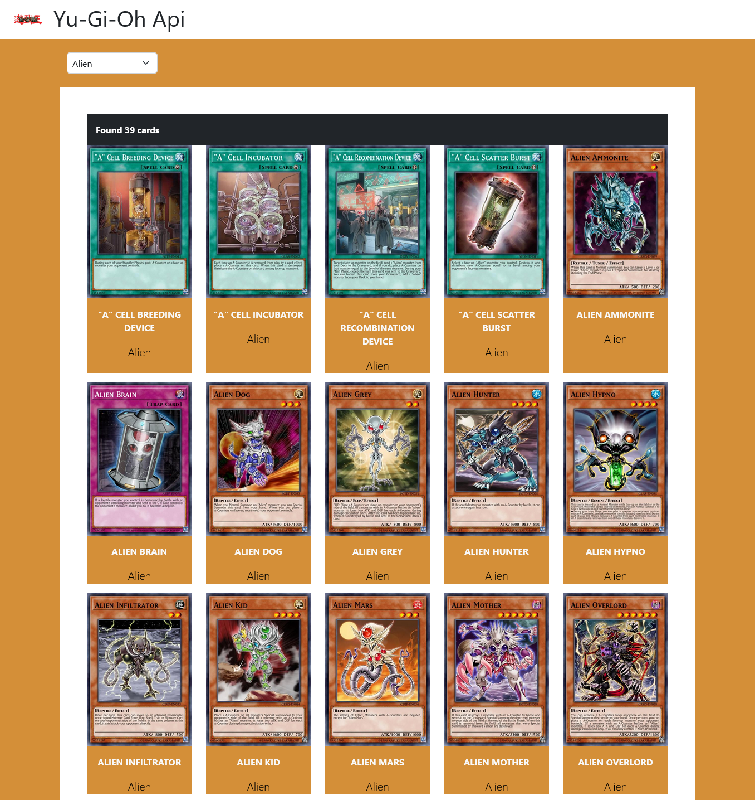

# Vite Yu-Gi-Oh

## Consegna Day 1

Creare un nuovo progetto utilizzando Vite e Vue 3 e definire i componenti necessari per strutturare il layout come da screenshot in basso.
Al caricamento della pagina, effettuare una chiamata ajax all'API di Yu Gi Oh: https://db.ygoprodeck.com/api/v7/cardinfo.php e con i dati restituiti, stamparee una card per ogni carta.

## Consegna Day 2

Continuare a lavorare nella stessa repo di ieri e aggiungere una select per filtrare i risultati in base all’archetipo.
Le option della select devono essere popolate dinamicamente chiamando questo endpoint dell'api:
https://db.ygoprodeck.com/api/v7/archetypes.php
Quando l'utente seleziona un valore dalla lista, viene effettuata una chiamata alle API con l'archetipo selezionato.
